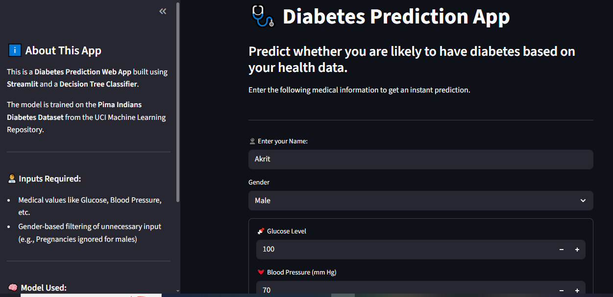
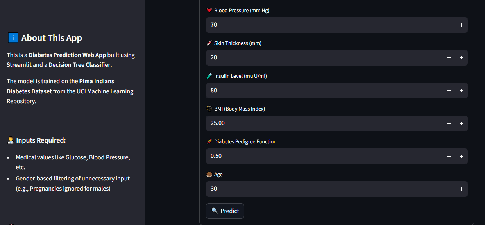
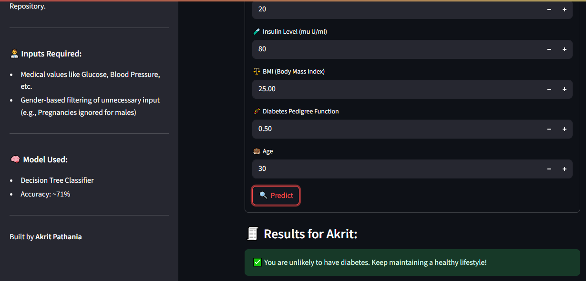

# 🩺 Diabetes Prediction Web App

A simple yet effective **Diabetes Prediction** web app built using **Streamlit** and a **Decision Tree Classifier**. The model is trained on the **Pima Indians Diabetes Dataset** and allows users to input their medical details to get an instant prediction on their diabetes status.

---

## 📌 Features

- 🎯 Predicts diabetes using medical inputs.
- 👨‍⚕️ Gender-based dynamic form fields.
- 🧠 Uses a Decision Tree Classifier trained with ~71% accuracy.
- 🌐 Interactive user interface using Streamlit.
- 💾 Trained model saved using `joblib` for easy loading.

---

## 🧪 Tech Stack

- **Python**
- **Pandas**, **NumPy**, **scikit-learn**, **Joblib**
- **Streamlit** for the web interface

---

## 📊 Dataset Used

- **Pima Indians Diabetes Dataset**

---

## 🚀 How to Run

```bash
# Clone the repo
git clone https://github.com/your-username/diabetes-prediction-app.git
cd diabetes-prediction-app

# Install dependencies
pip install -r requirements.txt

# Train model (optional if model file exists)
python model_trainer.py

# Run the app
streamlit run app.py
```
## 📝 Input Fields

The app takes the following inputs from the user:

- 👤 **Name**
- ⚧️ **Gender** (Male/Female)
- 🤰 **Pregnancies** *(only if Female)*
- 🍬 **Glucose Level**
- 💓 **Blood Pressure (mm Hg)**
- 💉 **Skin Thickness (mm)**
- 🧪 **Insulin (mu U/ml)**
- ⚖️ **BMI (Body Mass Index)**
- 🧬 **Diabetes Pedigree Function**
- 🎂 **Age**

---

## 📷 Screenshots







---

## ✅ Output

Once the user fills out the form and clicks on **🔍 Predict**, the app returns:

- A clear result:  
  - `⚠️ Likely to have diabetes` *(shown using `st.error`)*  
  - `✅ Unlikely to have diabetes` *(shown using `st.success`)*
- Result is personalized with the user's **Name**.
- A disclaimer is shown at the bottom for transparency.

```python
# Example output
if prediction == 1:
    st.error("⚠️ You are likely to have **diabetes**.")
else:
    st.success("✅ You are unlikely to have diabetes.")
```
---

## 🙌 Acknowledgements

- 📊 **Dataset Source:** [Kaggle - Pima Indians Diabetes Dataset](https://www.kaggle.com/uciml/pima-indians-diabetes-database)  
- 👨‍💻 **Developed by:** Akrit Pathania

